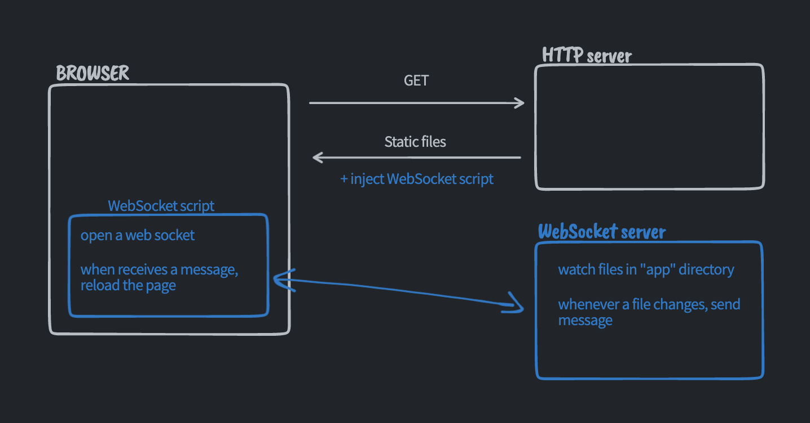

# live reload 🤖

Super simple WebSocket based live reloading. 

## You most likely don't need this 🙈

This is purely for learning purposes, so if you're looking for something solid, there are many
sophisticated solutions out there, e.g.
- [live-server](https://github.com/tapio/live-server)

## What's going on?

When you run `npm start` two servers spin up
 - HTTP server - serves static files and inject the live reload script, which by the way is 
   extremely simple. All it does, is it triggers page reload whenever it receives a message from the 
   WebSocket server.
 - WebSocket server - watches the files in `app` directory and sends a message to client WebSocket 
   whenever a file is changed.

## Resources 
Some resources that you might find useful:
- [Create a live-reload server](https://www.bscotch.net/post/create-a-live-reload-server)
- [live-server: How it works?](https://github.com/tapio/live-server#how-it-works)
- [WebSockets API](https://developer.mozilla.org/en-US/docs/Web/API/WebSockets_API)
- [websockets/ws](https://github.com/websockets/ws)
- [Launch browser from node server](https://h3manth.com/new/blog/2014/launch-browser-from-node-server/)
  - [sindresorhus/open](https://github.com/sindresorhus/open)
- [How to create a web server in Node.js](https://www.digitalocean.com/community/tutorials/how-to-create-a-web-server-in-node-js-with-the-http-module)
- [Node.js: fs.watch](https://nodejs.org/docs/latest/api/fs.html#fswatchfilename-options-listener)
